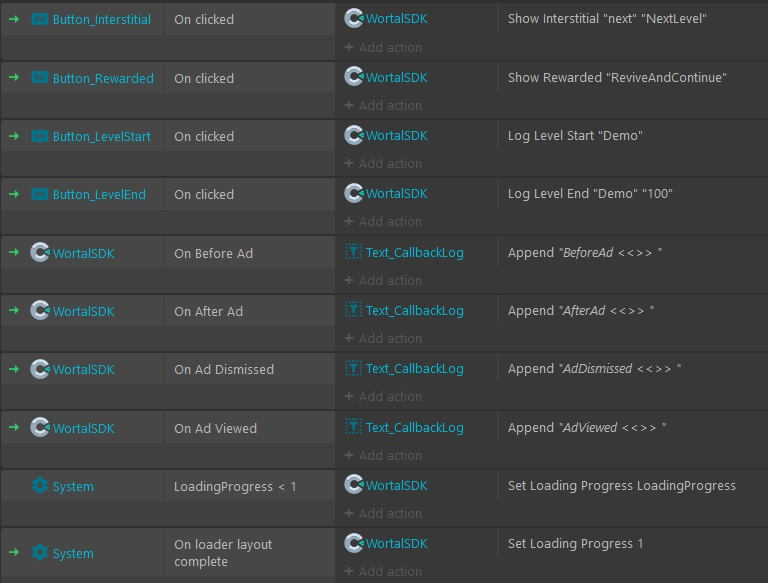

# Wortal SDK for Construct

## Installation

1. Install the plugin from the [Construct Addons](https://www.construct.net/en/make-games/addons/897/wortal) page
2. Add the `WortalSDK` object type into your project

### Building

1. Export your game to Web/HTML5
2. Unzip the build and locate the `index.html`
3. In the `<head>` add:

```html
<script src="https://html5gameportal.com/embeds/wortal-1.2.0.js"></script>
<script src="wortal.js"></script>
```

4. In the `<body>` add:

```html
<div class="loading-cover" id="loading-cover" style="background: #000; width: 100%; height: 100%; position: fixed; z-index: 100;"></div>
```

5. Create a `.zip` archive of the game with the `index.html` at the root
6. Upload build to the Wortal dashboard

## How to Use

### Loading Progress

Wortal SDK requires reporting of the layout loading progress to be compliant with our partner platforms. Add the following to your event sheet:

1. `System -> LoadingProgress < 1` // `WortalSDK -> SetLoadingProgress -> LoadingProgress`
2. `System -> On loader layout complete` // `WortalSDK -> SetLoadingProgress -> 1`

### Interstitial Ads

Interstitial ads are convenient to show to players at certain milestones throughout your game. Ex: Player finishes a level, player levels up, etc.

1. Add a condition in your event sheet that will call for an ad. Ex: `Next_Level_Button -> On Clicked`
2. Add the action to call for an ad. `WortalSDK -> Show Interstitial`

**NOTE**: Placement types passed as the first argument may only be the following:

- next
- start
- pause
- browse

If anything else is passed as an argument the ad will fail to show. See [this document](https://developers.google.com/ad-placement/docs/placement-types) for more details about the different types.

### Rewarded Ads

Rewarded ads can be used to offer the player bonuses or other incentives during the game. These ads are longer and require the player to watch the ad in its entirety to receive the reward, but are optional.

1. Add a condition in your event sheet that will call for an ad. Ex: `Revive_And_Continue_Button -> On Clicked`
2. Add the action to call for an ad. `WortalSDK -> Show Rewarded`

### Ad Callbacks
Various callback events are triggered for different ad events. You should listen for these callbacks and handle them accordingly in the event sheet.

1. `WortalSDK -> On Before Ad` - An ad is ready to show. Pause the game and audio here.
2. `WortalSDK -> On After Ad` - The ad event is finished. Resume the game here.
3. `WortalSDK -> On Ad Dismissed` - The player skipped the rewarded ad. Do not reward the player.
4. `WortalSDK -> On Ad Viewed` - The player watched the rewarded ad. Reward the player.

### Analytics

The analytics API can be used to track in game events to get a better understanding of how players are interacting with the game.

- `WortalSDK -> LogLevelStart` - Logs the beginning of a level.
- `WortalSDK -> LogLevelEnd` - Logs the end of a level. Will track the time spent in the level if the `Level` parameter matches the last `LogLevelStart` call.
- `WortalSDK -> LogLevelUp` - Logs the player leveling up.
- `WortalSDK -> LogScore` - Logs the player's score.
- `WortalSDK -> LogGameChoice` - Logs the player's choice when offered different options.
This can be useful for determining which characters are more popular, or paths are more commonly taken, etc.
This can be a powerful tool for balancing the game and giving the players more of what they enjoy.

### Demo Project

You can see the [Wortal Demo Project](wortal-demo.c3p) for an example of how to use the SDK.

### Example Event Sheet


