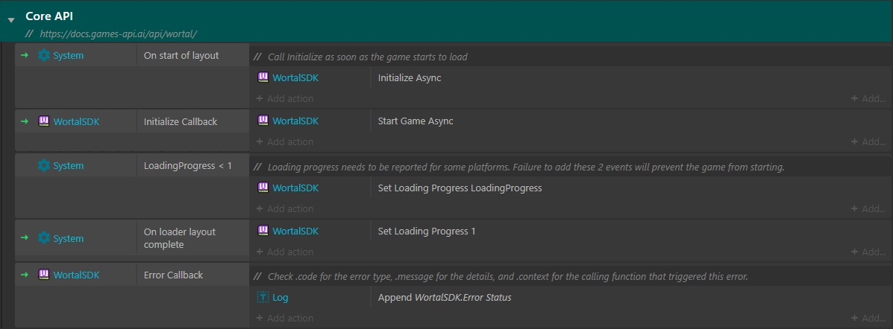
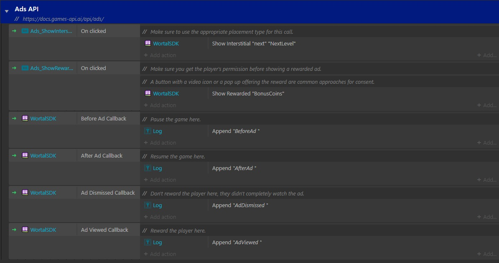
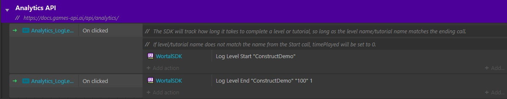
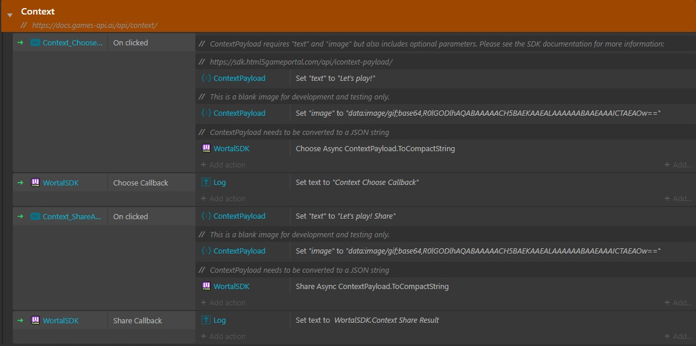
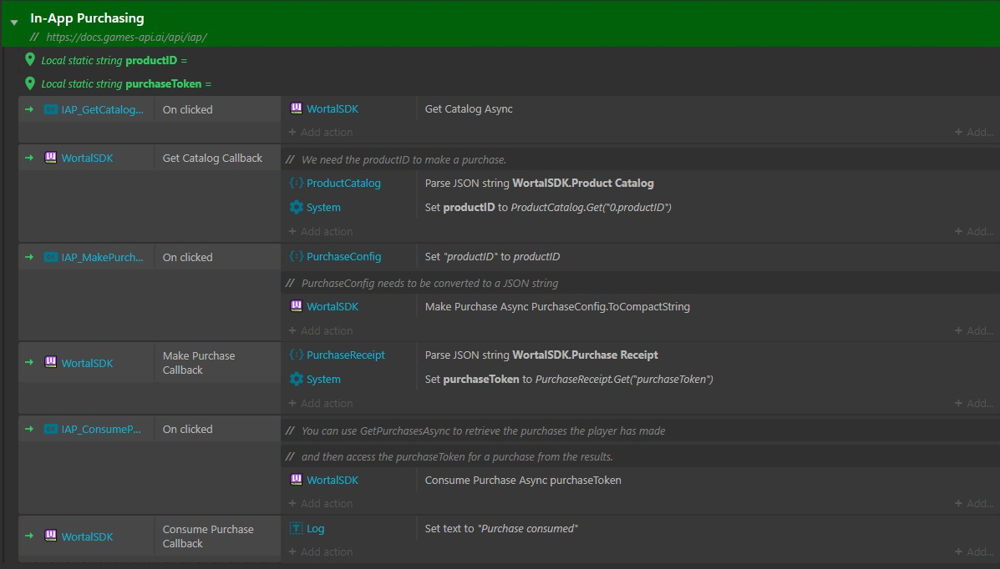
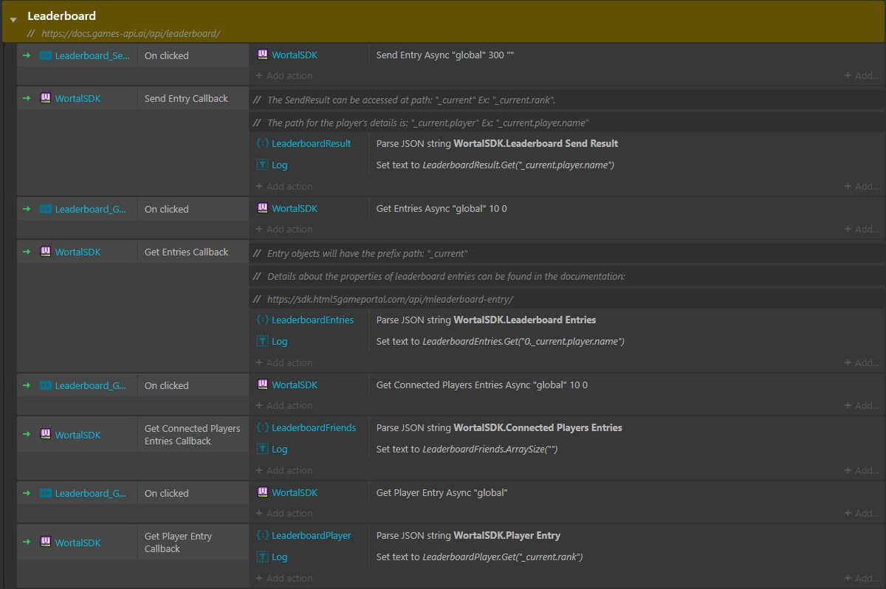
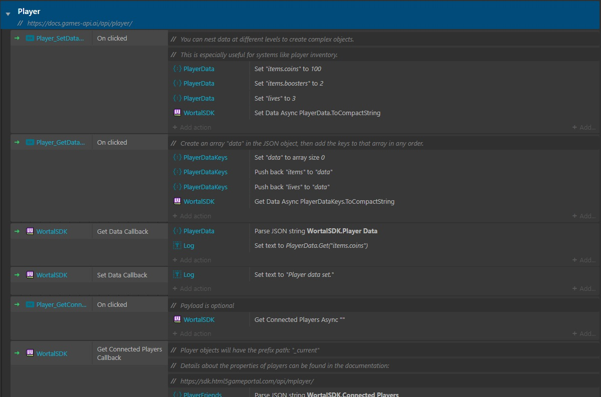
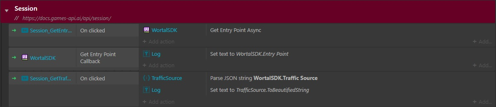

# Wortal SDK for Construct

## Installation

1. Install the plugin from the [Construct Addons](https://www.construct.net/en/make-games/addons/897/wortal) page
2. Add the `WortalSDK` object type into your project

## How to Use

### Initialization

Call `Initialize Async` as early as possible in your game, then `Start Game Async` when your game has finished loading
and is ready to play.

### Loading Progress

Wortal SDK requires reporting of the layout loading progress. See the event sheet above for how to report.

### Demo Project

You can see the [Wortal Demo Project](https://github.com/Digital-Will-Inc/wortal-sdk-construct/blob/master/wortal-demo.c3p) for an example of how to use the SDK.

### Ads

[API Reference](https://docs.games-api.ai/api/ads/)

Interstitial ads can be shown at various points in the game such as a level end, restart or a timed
interval in games with longer levels.

Rewarded ads can be shown too. These are longer, optional ads that the player can earn a reward for watching. The player
must be notified of the ad and give permission to show before it can be shown.

**NOTE**: Players should only be rewarded in the `adViewed` callback.

### Analytics

[API Reference](https://docs.games-api.ai/api/analytics/)

The Analytics API can be used to track game events that can help better understand how players are interacting with
the game. This data will be available for viewing in the Wortal dashboard.

### Context

[API Reference](https://docs.games-api.ai/api/context/)

The Context API is used to connect players and allow them to interact in the game session, share their content
and send messages to each other.

### In-App Purchases

[API Reference](https://docs.games-api.ai/api/iap/)

The In-App Purchases (IAP) API is used to provide an interface for in-game transactions on the platforms.
This process will differ based on what platform the game is being played on, but the API remains the same.

### Leaderboards

[API Reference](https://docs.games-api.ai/api/leaderboard/)

The Leaderboard API gives the game access to the platform's leaderboard functionality. This is where
you can track player's scores and compare them to other players.

### Player

[API Reference](https://docs.games-api.ai/api/player/)

You can find details about the current player via the Player API.

### Session

[API Reference](https://docs.games-api.ai/api/session/)

Details about the current session can be accessed in the Session API.

